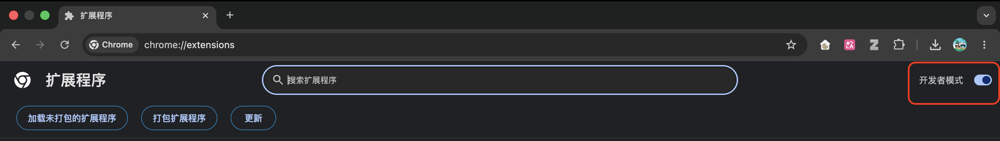

# SCUT 课堂助手


把课堂声音变成连续字幕，把点名、提问、作业与课程要求留下来。**0.5.0** 提供本地 Whisper 识别、可最小化的课堂实况、DeepSeek 重点分析、回放转写与课程时间线；优先适配 Windows + Edge，兼容 Chrome MV3。

## 特别感谢

特别感谢我的同学 **[jbykkk](https://github.com/jbykkk)** 开源的 **[scut-courses-replay-extraction](https://github.com/jbykkk/scut-courses-replay-extraction)**。这个项目从他的课程回放字幕提取工具出发，沿用原有的学校字幕读取、格式转换、浏览器扩展与命令行能力，再逐步加入本地识别和课堂辅助功能。感谢他打下的基础与分享精神！上游代码的版权声明与 MIT 许可继续保留，见 [LICENSE](LICENSE)。

## 第一次使用

1. 安装 [uv](https://docs.astral.sh/uv/)，准备本机的 Faster Whisper 模型与 FFmpeg。模型和 CUDA 运行库仅从已有安装读取，不自动下载模型。
2. 在项目目录双击 **启动课堂助手.cmd**，打开本地安装向导。初次运行会安装本项目依赖。
3. Edge 地址栏打开 `edge://extensions`，启用开发者模式，加载项目里的 **extension 文件夹**。Chrome 使用 `chrome://extensions`。扩展是本地版，商店里搜不到。
4. 按向导复制本地连接口令，在扩展的“偏好设置 → 连接与安装”粘贴并连接。把 SCUT 课堂助手固定到工具栏。
5. 正常登录学校课程网站，打开课时并播放声音，点击扩展 → **开始实时字幕**。需要智能分析时，在设置中保存自己的 DeepSeek API Key；本地字幕可独立使用。

完整说明：[ASSISTANT.md](ASSISTANT.md) · 验证范围：[VALIDATION.md](VALIDATION.md) · 网站研究：[SITE_FINDINGS.md](SITE_FINDINGS.md)

## 上课时怎么打开、怎么关闭

**录音在后台进行，课堂实况和工具栏面板都是查看入口。重新点开它们不会重新录音。**

| 想做什么 | 操作 | 对录音的影响 |
| --- | --- | --- |
| 暂时不看字幕窗 | 关闭或最小化课堂实况 | 继续录音与分析 |
| 再次查看连续字幕 | 点击工具栏 / 扩展菜单里的 SCUT 课堂助手 → 返回正在录音的课堂 | 恢复同一课堂，不重启 |
| 看这节课的详情 | 实况窗 → 本课详情与总结 | 只打开字幕、提醒、概览和导出 |
| 找以前的记录 | 扩展 → 所有课程 / 历史记录 → 点击课时 | 不影响录音 |
| 下课 | 结束录音并保存 | 停止采集，补传音频并完成处理 |
| 升级扩展 | 先结束并保存、等上传为 0，再在扩展管理页重新加载 | 重新加载会销毁录音上下文 |

保持学校播放页、浏览器和本地服务运行。点扩展菜单里的名称是“打开面板”；扩展管理页的“重新加载”是升级操作，两者不同。实时识别会有音频窗口延迟，术语和噪声仍可能误识别；有疑问时核对原音频。实时语言默认自动检测，可选本机语音模型；DeepSeek 支持 V4 Flash、V4 Pro 和自定义模型名。

音频、字幕、课堂记录、连接口令和加密 API Key 存放在被忽略的 `.local/`，不随仓库发布。开启智能分析时仅发送本课转写文字与时间戳；不发送学校 Cookie、音频或视频源地址。只处理听得见的语音，没有 PPT OCR、二维码视觉识别或自动签到。

## 原版课程回放字幕提取

以下保留上游工具的使用方式。**扩展中的“原版字幕下载”不需要本地语音服务；“开始实时字幕”需要上面的本地服务。**

从华南理工大学“百步梯学堂”中提供的课程回放平台“华园视频”提取**课程回放字幕**，支持 JSON、SRT、纯文本三种格式，可批量导出同一课程字幕并打包为ZIP。

本项目会根据课程链接自动选择正确入口：

| 使用环境 | 站点 |
|------|------|
| 校内网络 | `https://video.jw.scut.edu.cn` |
| 校外网络 | `https://video-jw-443.webvpn.scut.edu.cn` |

校外入口由学校 WebVPN 代理校内站点。程序不会绕过 WebVPN 或学校统一认证；使用前仍需由本人正常登录并拥有相应课程的访问权限。

提供两种使用方式：**Chrome/Edge 浏览器插件**和**命令行工具**。

## 免责声明
本项目仅用于个人学习交流与课程复习，使用到的所有内容均来自于课程界面公开信息。
不会绕过学校统一认证，也不会破解视频权限，仅对用户本人已拥有访问权限的课程页面进行字幕提取。

请勿将导出的课程内容用于：
- 公开传播
- 商业用途
- 未经授课教师许可的二次分发

及其他滥用、涉嫌侵害他人隐私或权利的行为。

# 如何使用？

## 方式一：Chrome 插件（推荐）

无需安装任何依赖，在课程页面一键下载字幕。适合日常使用。

### 安装

1. Chrome 网址栏输入 `chrome://extensions/` 打开插件面板或直接点击右上角插件模块进入。
2. 右上角开启 **开发者模式**

3. 点击 **“加载已解压的扩展程序”**
4. 选择本项目的 `extension/` 目录并确定。

安装成功后，浏览器右上角会出现插件图标与名称。

Microsoft Edge 插件安装同理。

### 使用

> **前提**：必须先在当前使用的华园视频入口完成登录。校外使用时要先登录 WebVPN，校内和校外登录状态不能互相替代。

#### 单课时下载

1. 打开任意课程播放页面：校内地址为 `video.jw.scut.edu.cn/livingroom?...`，校外地址为 `video-jw-443.webvpn.scut.edu.cn/livingroom?...`
2. 点击浏览器右上角的插件图标，弹窗显示当前课时信息（课程名、教师、课时标题）
3. 勾选格式（`SRT / TXT / JSON`），点击 **下载字幕**

#### 批量下载

1. 在弹窗中切换到 **全部课时** 标签页
2. 显示该课程所有课时的列表（默认全选），取消勾选不需要的课时
3. 选择格式后点击 **下载全部 (ZIP)**
4. 所有字幕打包为一个 ZIP 文件下载

#### 输出格式

| 格式 | 说明 |
|------|------|
| `.srt` | 标准字幕文件，含时间轴，可直接用于视频播放器 |
| `.txt` | 纯文本，无时间信息，便于阅读和搜索 |
| `.json` | 以 `json` 风格切分的字幕，含 `BeginSec / EndSec / Text` 字段 |

#### 常见问题

**弹窗显示"请先打开课程播放页面"**
当前标签页不是华园视频的课程播放页，请先打开一个课程页面。

**下载失败或显示 HTTP 错误**
登录状态可能已过期，请在当前使用的华园视频入口重新登录后重试。校外入口需要重新登录 WebVPN。

**部分课时没有字幕**
新录制的课程可能尚未生成字幕，或该课时没有语音内容。失败的课时会显示在下载结果中，同时输出到浏览器控制台。

**下载被浏览器拦截**
Chrome 可能阻止了自动下载，检查地址栏右侧是否有下载被阻止的提示，点击允许/保留即可。

---

## 方式二：命令行工具

适合接口调试、自动化脚本等场景，基于 Python + Playwright。日常使用推荐方式一的浏览器插件。

### 安装

本项目采用 [uv](https://docs.astral.sh/uv/) 统一管理环境。

```bash
uv sync
uv run playwright install chromium
```

### 使用

```bash
# 1. 登录校内站点（默认）
uv run python main.py login

# 校外使用时登录 WebVPN
uv run python main.py login --site external

# 2. 获取单节课字幕（粘贴课程链接）
uv run python main.py get "https://video.jw.scut.edu.cn/livingroom?course_id=64762&sub_id=554146&tenant_code=21"

# 校外链接会被自动识别
uv run python main.py get "https://video-jw-443.webvpn.scut.edu.cn/livingroom?course_id=64762&sub_id=554146&tenant_code=21"

# 交互式输入（不带参数）
uv run python main.py get
请粘贴课程链接（回车确认）：
> https://video.jw.scut.edu.cn/livingroom?course_id=64762&sub_id=554146&tenant_code=21

# 3. 批量导出整门课程
uv run python main.py get --all "https://video.jw.scut.edu.cn/livingroom?course_id=64762&sub_id=554146&tenant_code=21"

# 校外整门课程同样会自动选择 WebVPN 入口
uv run python main.py get --all "https://video-jw-443.webvpn.scut.edu.cn/livingroom?course_id=64762&sub_id=554146&tenant_code=21"
```

### 输出

每次抓取生成三个文件：

| 格式 | 路径 | 说明 |
|------|------|------|
| `.json` | `output/json/<sub_id>.json` | `json` 风格切分的字幕，含 `BeginSec/EndSec/Text` |
| `.srt` | `output/srt/<sub_id>.srt` | 标准字幕格式，含时间轴 |
| `.txt` | `output/txt/<sub_id>.txt` | 纯文本，无时间信息 |

### 字幕数据示例

**.srt：**
```
7
00:01:33,000 --> 00:01:37,000
刚刚呢我们正好讲完了我们的这个第一节的内容
```

**.txt：**
```
嗯嗯好好好好好
感谢大家冒雨前来上课。
那今天是咱们最后一次课，啊然后因为今天咱们也是两节
```

---

## 项目结构

```
├── main.py              # CLI 入口
├── browser.py           # Playwright 浏览器管理与网络拦截
├── subtitle.py          # JSON → SRT/TXT 格式转换
├── config.py            # URL 与配置常量
├── auth.py              # 登录状态管理
├── extension/           # Chrome 插件
│   ├── manifest.json
│   ├── popup.html
│   ├── popup.js
│   └── jszip.min.js
├── output/              # 字幕输出（CLI）
│   ├── json/
│   ├── srt/
│   └── txt/
└── data/                # 登录状态（CLI）
```

具体实现详见 [ARCHITECTURE.md](./ARCHITECTURE.md)。

## 已知限制

- **CLI 需要有头浏览器** — headless 模式下播放器不会触发字幕 API 请求
- **登录状态会过期** — Cookie 失效后需重新扫码登录对应站点

## 权限说明

插件在 `video.jw.scut.edu.cn` 和 `video-jw-443.webvpn.scut.edu.cn` 课程页读取课时、字幕与媒体地址，并通过 `127.0.0.1` 连接本地语音服务。音频捕获由用户点击开始；只捕获所选课程标签页。

字幕和音频保存在本机。勾选 DeepSeek 分析后，转写文字会发往 DeepSeek API；不发送学校 Cookie、账号信息、视频源地址或音频。详见 [本地助手数据说明](ASSISTANT.md#数据和密钥)。
